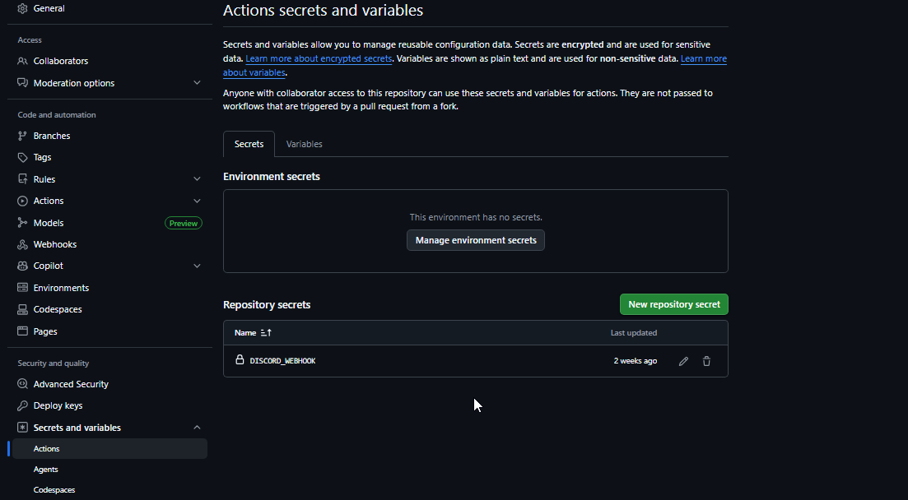

# Night-Void-bot 

Discord bot for the [Night Void server](https://discord.gg/sAakXRRudu). Moderation tools, member utilities, and GitHub integration — all in Arabic.

---

## What makes it different

- **All Arabic** — every response, embed, and error message is in Arabic
- **GitHub → Discord pipeline** — pushes and new issues post automatically to the server via webhook
- **Custom embed builder** — members can generate their own embeds on the fly
- **Warning system** — admins can DM warnings directly from a slash command
- **Cooldown on everything** — 20-second per-user cooldown across all commands, both prefix and slash
- **Owner commands** — a private Cog restricted to whoever runs the bot. Includes reloading all Cogs live without restarting, syncing slash commands, changing the bot status, checking memory usage and uptime, and mass-DMing every server member with a confirmation step and rate-limiting built in. Anyone who deploys this with their own token gets full access to all of it
> Mass-DMing is a feature you use at your own risk. I am not responsible if your bot gets flagged, rate-limited, or banned by Discord.

---

## Project Structure

```
Night-Void-bot/
├── .github/workflows/
│   ├── Discord Notify.yml    # Push/release → Discord
│   └── Issue Notify.yml      # New issue → Discord
├── Bot/
│   ├── Nightvoidbot.py       # Entry point
│   ├── cogs/
│   │   ├── OwnerCommands.py  # Private
│   │   ├── adminprefix.py    # Admin prefix commands
│   │   ├── adminslash.py     # Admin slash commands
│   │   ├── memberprefix.py   # Member prefix commands
│   │   └── memberslash.py    # Member slash commands
│   ├── logger.py             # Logging
│   └── utilities.py          # Cooldowns, permission checks, shared helpers
├── .python-version           # 3.13.13
├── Procfile                  # Railway process definition
├── requirements.txt
└── .env                      # Not committed — see below
```

---

## Setup

**1. Clone**

```bash
git clone https://github.com/itsreallyhex/Night-Void-bot.git
cd Night-Void-bot
```

**2. Install dependencies**

```bash
pip install -r requirements.txt
```

**3. Create a `.env` file**

```env
BOT_TOKEN=your_discord_bot_token_here
GUILD_ID=your_server_id_here
```

**4. Run**

```bash
python Bot/Nightvoidbot.py
```

---

## Environment Variables

| Variable | Description |
|---|---|
| `BOT_TOKEN` | Your Discord bot token |
| `GUILD_ID` | Your Discord server ID |

For GitHub Actions, add `DISCORD_WEBHOOK` to your repo secrets (Settings → Secrets and variables → Actions):



---

## Deployment

Hosted on [Railway](https://railway.com/). Railway deploys from the `dev` branch — not `main`.

```
worker: python Bot/Nightvoidbot.py
```

---

## Built With

| Tool | Purpose |
|---|---|
| [discord.py](https://discordpy.readthedocs.io/) | Discord API wrapper |
| [python-dotenv](https://pypi.org/project/python-dotenv/) | Environment variables |
| [psutil](https://pypi.org/project/psutil/) | System stats for bot diagnostics |
| [Railway](https://railway.com/) | Hosting |

---

## License

MIT — see [LICENSE](LICENSE).